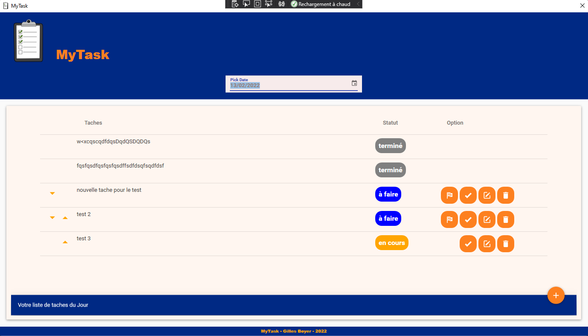
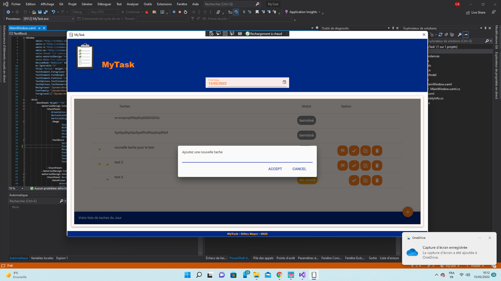

# Application TODO C#

## Pour Générer le Projet : 
### Prérequis :
 - Avoir Visual Studio (2019)
### Process : 
- git Clone du projet de Todo
- Ouvrir le projet avec visual studio : Fichier=>Ouvir=>Projet/Solution =>MyTask.csproj
- Dans l'explorateur de solution Click Droit sur MyTask => Regénérer

## Detail du Projet :
Il s’agit de créer une application qui gère une liste de tâches a effectuer. Vous devez utiliser les technologies suivante : C#, SQLite pour le stockage des données.

## Contrainte :
	- Projet à effectuer en 5 jours
	- Projet Individuel
    - Repository  Git contenant : 
       > 1 wireframe de l'écran principal. 
       > Le code source de l'application.
       > Tout les éléments nécessaire à la compilation. 
       > 1 ficher README.md utilisant le langage Markdown, qui décrit le projet, son déploiement et les étapes de travail.

## Difficulté :
	- La volonté de mise en place d'un projet MVVM 
	- Beaucoup de documention autour de nouvelle notion (MVVM, Sqlite, nouvelle propriété, ...)
	- Logique de gestion du fonctionnement

## Pour aller plus loin :
	- Optimisation du code,
	- Création d'un menu grace au clic droit de la souris,
	- Amélioration du graphisme d'affichage

## User Story:
 - [x] Un utilisateur peut ajouter / Supprimer une tache
 - [x] Un Utilisateur peut modifier le statut d'une tache en ("à faire", "en cours", "terminé")
 - [x] Un utilisateur peut afficher les tachew  du jour et les taches non terminé  des jours antérieurs avec leurs statuts
 - [x] Un utilisateur peut consulter les taches terminé et antérieur à la date du jour
 - [x] Un utilisateur peut modifier l'ordre d'affichage des taches

## UML et Wireframes
 
L'uml et le Wireframe est visible grace au lien :
[Uml et Wireframes](https://www.canva.com/design/DAE3k7V0M90/kk9d9EekMTPnM7oHq6oAuw/view)

## Executable

Dans le Dossier Executable, retrouvez un fichier MyTask.exe qui vous permettra d'installer l'application sur un ordinateur windows.

## Screen Application

### First Start App : 

### Add new task :

